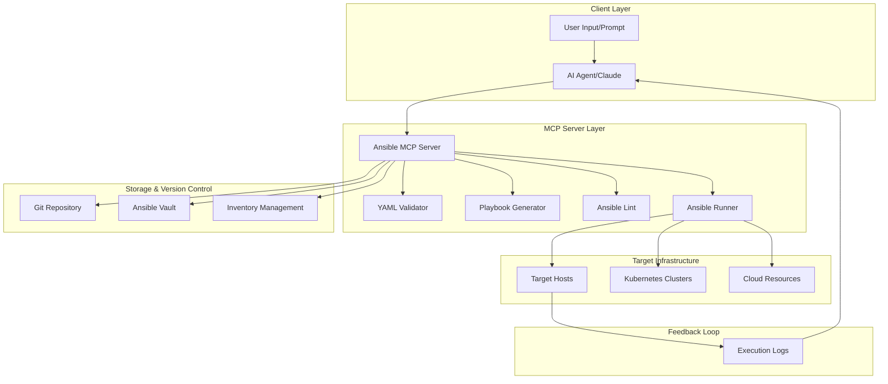

# 🚀 Ansible MCP Server - AI-Powered Playbook Generation

[](https://opensource.org/licenses/MIT)
[](https://nodejs.org)
[](https://www.python.org)
[](https://www.ansible.com)
[](https://www.docker.com)
[](https://modelcontextprotocol.io)

An intelligent Ansible playbook generator that leverages the Model Context Protocol (MCP) to transform natural language prompts into production-ready Ansible playbooks. This solution integrates AI capabilities with DevOps best practices to automate infrastructure provisioning and configuration management.

## ✨ Features

- 🤖 **AI-Powered Generation**: Convert natural language descriptions into Ansible playbooks
- ✅ **Automated Validation**: Built-in YAML syntax checking and Ansible-lint integration
- 🔧 **15+ Templates**: Pre-built templates for common infrastructure patterns
- 🔒 **Security First**: HashiCorp Vault integration for secrets management
- 📊 **Full Observability**: Prometheus metrics and Grafana dashboards
- 🔄 **GitOps Ready**: Git integration for version control and CI/CD
- 🐳 **Containerized**: Fully dockerized deployment
- 🎯 **MCP Integration**: Native support for Model Context Protocol

## 📋 Architecture Overview



## 🚀 Key Components

### 1. **Ansible MCP Server**
- Custom MCP server implementation for Ansible operations
- Built with TypeScript/Python hybrid approach
- Integrates with AI models for intelligent playbook generation

### 2. **Playbook Generator Module**
- Template-based generation
- AI-assisted task creation
- Best practices enforcement
- Security scanning

### 3. **Validation & Testing Pipeline**
- YAML syntax validation
- Ansible-lint integration
- Molecule testing framework
- Dry-run capabilities

### 4. **Execution & Monitoring**
- Secure credential management
- Real-time execution tracking
- Error handling and recovery
- Performance metrics

## 🛠️ Implementation Steps

### Phase 1: MCP Server Development
1. Core MCP server setup
2. Tool definitions
3. API endpoints
4. Authentication layer

### Phase 2: AI Integration
1. LLM prompt engineering
2. Template library
3. Context management
4. Learning feedback loop

### Phase 3: Validation Pipeline
1. Syntax checking
2. Security scanning
3. Best practices validation
4. Testing automation

### Phase 4: Execution Framework
1. Ansible runner integration
2. Credential management
3. Logging and monitoring
4. Error recovery

## 📊 Workflow Process

```yaml
workflow:
  - name: "Receive User Prompt"
    action: parse_requirements
    output: structured_requirements
    
  - name: "Generate Playbook"
    action: create_playbook
    input: structured_requirements
    output: draft_playbook
    
  - name: "Validate Structure"
    action: validate_yaml
    input: draft_playbook
    output: validation_results
    
  - name: "Apply Linting"
    action: ansible_lint
    input: draft_playbook
    output: lint_results
    
  - name: "Iterative Refinement"
    action: refine_playbook
    condition: validation_failed
    
  - name: "Store in Version Control"
    action: git_commit
    input: final_playbook
    
  - name: "Execute Playbook"
    action: run_playbook
    input: final_playbook
    output: execution_results
```

## 🚀 Quick Start

### Prerequisites

- Docker & Docker Compose (v2.0+)
- Node.js (v20+) for local development
- Python (3.10+) for AI components
- Git for version control

### Installation

```bash
# Clone the repository
git clone https://github.com/shellsnake/ansible-mcp-server.git
cd ansible-mcp-server

# Start all services
docker-compose up -d

# Check service health
docker-compose ps

# View logs
docker-compose logs -f ansible-mcp
```

### Basic Usage

```bash
# Generate a playbook from natural language
curl -X POST http://localhost:3000/execute \
  -H "Content-Type: application/json" \
  -d '{
    "tool": "generate_playbook",
    "arguments": {
      "prompt": "Deploy a secure web application with nginx and SSL",
      "context": {
        "environment": "production"
      }
    }
  }'
```

## 🔧 Technical Stack

- **MCP Framework**: Model Context Protocol
- **Languages**: TypeScript, Python
- **Ansible**: 2.15+
- **Validation**: ansible-lint, yamllint
- **Testing**: Molecule, Testinfra
- **Version Control**: Git, GitLab CI/CD
- **Container**: Docker, Kubernetes
- **Security**: Ansible Vault, HashiCorp Vault

## 🎯 Benefits

1. **Automation**: Fully automated playbook generation
2. **Quality**: Built-in best practices and validation
3. **Security**: Integrated security scanning
4. **Scalability**: Cloud-native architecture
5. **Observability**: Complete execution tracking
6. **Reusability**: Template library and versioning
