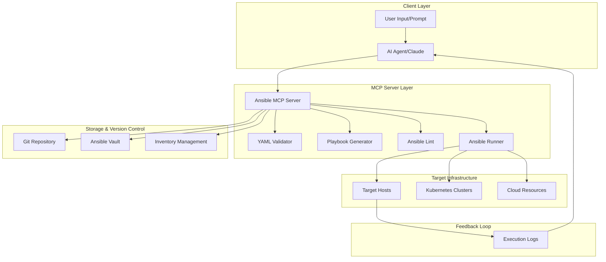

# 🚀 Ansible MCP Server - AI-Powered Playbook Generation

[](https://opensource.org/licenses/MIT)
[](https://nodejs.org)
[](https://www.python.org)
[](https://www.ansible.com)
[](https://www.docker.com)
[](https://modelcontextprotocol.io)
[](https://github.com/w7-mgfcode/Mannos-ANSIBLE_MCP-solution)

An intelligent Ansible playbook generator that leverages the Model Context Protocol (MCP) to transform natural language prompts into production-ready Ansible playbooks. This solution integrates AI capabilities with DevOps best practices to automate infrastructure provisioning and configuration management.

**🆕 v2.0.0**: Full MCP 2025-03-26 specification compliance with tool annotations, enhanced error handling, and McpServer high-level API.

**🔒 v2.1.0**: Comprehensive security hardening, infrastructure integration, and testing infrastructure.

## ✨ Features

### Core Features
- 🤖 **AI-Powered Generation**: Convert natural language descriptions into Ansible playbooks
- ✅ **Automated Validation**: Built-in YAML syntax checking and Ansible-lint integration
- 🔧 **15+ Templates**: Pre-built templates for common infrastructure patterns
- 🎯 **MCP Integration**: Native support for Model Context Protocol
- 📚 **Prompt Template Library**: Optimized templates with few-shot learning and chain-of-thought reasoning
- 🧠 **Context Enrichment**: Environment-specific hints and best practices injection
- 📋 **Template Versioning**: Full version control and changelog tracking for templates

### Security Features (NEW)
- 🔐 **Command Injection Protection**: All shell commands use safe execFile with argument arrays
- 🛡️ **Path Traversal Prevention**: Validates all file paths against allowed directories
- 🔍 **Secrets Detection**: Scans playbooks for hardcoded credentials (AWS keys, passwords, tokens, private keys)
- ⏱️ **Rate Limiting**: Configurable request throttling (default: 100 req/min)
- 📁 **Secure File Permissions**: Generated playbooks use 0o600 permissions
- 🏷️ **Input Sanitization**: Tags and user inputs sanitized to prevent injection

### Infrastructure Integration (NEW)
- 🔒 **HashiCorp Vault**: Full API integration for dynamic secrets management
- 💾 **Redis Integration**: Connection pooling and caching support
- 📊 **Prometheus Metrics**: 7 custom metrics (counters, histograms, gauges)
- 🏥 **Health Checks**: `/health` endpoint with dependency status
- 📈 **Metrics Endpoint**: `/metrics` endpoint for Prometheus scraping
- 📝 **Winston Logging**: Structured JSON logging with file transport

### Observability
- 📊 **Full Observability**: Prometheus metrics and Grafana dashboards
- 🔄 **GitOps Ready**: Git integration for version control and CI/CD
- 🐳 **Containerized**: Fully dockerized deployment
- 🧪 **Testing Infrastructure**: Jest (TypeScript) and pytest (Python) test suites

## 📋 Architecture Overview



## 🚀 Key Components

### 1. **Ansible MCP Server**
- Custom MCP server implementation for Ansible operations
- Built with TypeScript/Python hybrid approach
- Integrates with AI models for intelligent playbook generation

### 2. **Playbook Generator Module**
- Template-based generation
- AI-assisted task creation
- Best practices enforcement
- Security scanning

### 3. **Validation & Testing Pipeline**
- YAML syntax validation
- Ansible-lint integration
- Molecule testing framework
- Dry-run capabilities

### 4. **Execution & Monitoring**
- Secure credential management
- Real-time execution tracking
- Error handling and recovery
- Performance metrics

## 🛠️ Implementation Steps

### Phase 1: MCP Server Development
1. Core MCP server setup
2. Tool definitions
3. API endpoints
4. Authentication layer

### Phase 2: AI Integration
1. LLM prompt engineering
2. Template library
3. Context management
4. Learning feedback loop

### Phase 3: Validation Pipeline
1. Syntax checking
2. Security scanning
3. Best practices validation
4. Testing automation

### Phase 4: Execution Framework
1. Ansible runner integration
2. Credential management
3. Logging and monitoring
4. Error recovery

## 📊 Workflow Process

```yaml
workflow:
  - name: "Receive User Prompt"
    action: parse_requirements
    output: structured_requirements
    
  - name: "Generate Playbook"
    action: create_playbook
    input: structured_requirements
    output: draft_playbook
    
  - name: "Validate Structure"
    action: validate_yaml
    input: draft_playbook
    output: validation_results
    
  - name: "Apply Linting"
    action: ansible_lint
    input: draft_playbook
    output: lint_results
    
  - name: "Iterative Refinement"
    action: refine_playbook
    condition: validation_failed
    
  - name: "Store in Version Control"
    action: git_commit
    input: final_playbook
    
  - name: "Execute Playbook"
    action: run_playbook
    input: final_playbook
    output: execution_results
```

## 🚀 Quick Start

### Prerequisites

- Docker & Docker Compose (v2.0+)
- Node.js (v20+) for local development
- Python (3.10+) for AI components
- Git for version control

### Installation

```bash
# Clone the repository
git clone https://github.com/shellsnake/ansible-mcp-server.git
cd ansible-mcp-server

# Start all services
docker compose up -d

# Check service health
docker compose ps

# View logs
docker compose logs -f ansible-mcp
```

### Basic Usage

```bash
# Generate a playbook from natural language
curl -X POST http://localhost:3000/execute \
  -H "Content-Type: application/json" \
  -d '{
    "tool": "generate_playbook",
    "arguments": {
      "prompt": "Deploy a secure web application with nginx and SSL",
      "context": {
        "environment": "production"
      }
    }
  }'
```

## 🔐 Security Configuration

### Environment Variables

```bash
# Security Settings
MCP_API_KEY=your-api-key           # API key for authentication
MCP_ENABLE_AUTH=true               # Enable authentication (default: false)

# Infrastructure Integration
REDIS_HOST=localhost               # Redis host (default: localhost)
REDIS_PORT=6379                    # Redis port (default: 6379)
VAULT_ADDR=http://localhost:8200   # HashiCorp Vault address
VAULT_TOKEN=your-vault-token       # Vault authentication token

# Monitoring
METRICS_PORT=9090                  # Prometheus metrics port (default: 9090)
LOG_LEVEL=info                     # Logging level (debug, info, warn, error)

# AI Provider
AI_PROVIDER=openai                 # AI provider (openai, anthropic, gemini, ollama)
AI_MODEL=gpt-4.1                   # Model to use
OPENAI_API_KEY=sk-your-key         # API key for AI provider
```

### Health Check & Metrics

```bash
# Check server health
curl http://localhost:9090/health

# Response example:
{
  "status": "healthy",
  "checks": {
    "redis": { "status": "healthy", "latency": 2 },
    "vault": { "status": "healthy", "latency": 15 },
    "aiProvider": { "status": "healthy" }
  },
  "timestamp": "2025-11-18T12:00:00.000Z"
}

# Get Prometheus metrics
curl http://localhost:9090/metrics
```

### Prometheus Metrics

| Metric Name | Type | Description |
|-------------|------|-------------|
| `ansible_mcp_playbooks_generated_total` | Counter | Total playbooks generated |
| `ansible_mcp_playbooks_executed_total` | Counter | Total playbooks executed |
| `ansible_mcp_validation_errors_total` | Counter | Validation error count |
| `ansible_mcp_execution_duration_seconds` | Histogram | Playbook execution duration |
| `ansible_mcp_secrets_detected_total` | Counter | Potential secrets detected |
| `ansible_mcp_auth_failures_total` | Counter | Authentication failures |
| `ansible_mcp_active_connections` | Gauge | Active connections |

### Secrets Detection

The server automatically scans playbooks for potential hardcoded secrets:
- AWS Access Keys (`AKIA...`)
- Passwords and secrets
- Private keys (RSA, EC, DSA, OpenSSH)
- GitHub tokens (`ghp_`, `ghs_`)
- Slack tokens
- JWTs
- Bearer tokens

Detected secrets are reported in the response with line numbers for remediation.

## 🧪 Testing

### Run TypeScript Tests (Jest)

```bash
npm test                    # Run all tests
npm test -- --coverage      # With coverage report
npm test -- --watch         # Watch mode
```

### Run Python Tests (pytest)

```bash
pip install pytest pyyaml
python -m pytest tests/ -v  # Run all tests
python -m pytest tests/ -v --tb=short  # Short traceback
```

### Test Coverage

- **Security tests**: Path validation, secrets detection, rate limiting
- **Validation tests**: YAML syntax, best practices, input sanitization
- **Integration tests**: Prompt analysis, template generation
- **Edge case tests**: Error handling, Unicode, empty inputs

## 📚 Prompt Template Library

The Prompt Template Library provides optimized templates with few-shot learning examples, chain-of-thought reasoning, and context enrichment for consistent, production-ready playbook generation.

### Available Template Categories

| Category | Template ID | Description |
|----------|-------------|-------------|
| Kubernetes | `kubernetes-deployment` | K8s deployments with scaling, health checks, HPA |
| Docker | `docker-setup` | Docker & Compose installation with security |
| Security | `security-hardening` | CIS benchmark-based system hardening |
| Database | `database-setup` | PostgreSQL/MySQL with replication & backup |
| Monitoring | `monitoring-stack` | Prometheus + Grafana deployment |
| CI/CD | `cicd-pipeline` | Jenkins/GitLab CI setup |
| Cloud | `cloud-infrastructure` | AWS/Azure/GCP provisioning |
| Network | `network-configuration` | Load balancers, SSL, routing |

### Using Templates

```bash
# List available templates
curl -X POST http://localhost:3000/execute \
  -H "Content-Type: application/json" \
  -d '{
    "tool": "list_prompt_templates",
    "arguments": {
      "category": "kubernetes"
    }
  }'

# Generate with optimized template
curl -X POST http://localhost:3000/execute \
  -H "Content-Type: application/json" \
  -d '{
    "tool": "generate_with_template",
    "arguments": {
      "prompt": "Deploy a web app with 5 replicas and auto-scaling",
      "template_id": "kubernetes-deployment",
      "context": {
        "environment": "production",
        "target_hosts": "k8s_cluster"
      }
    }
  }'

# Enrich a prompt with few-shot examples
curl -X POST http://localhost:3000/execute \
  -H "Content-Type: application/json" \
  -d '{
    "tool": "enrich_prompt",
    "arguments": {
      "prompt": "Setup PostgreSQL with replication",
      "template_id": "database-setup"
    }
  }'
```

### Template Features

- **Few-Shot Learning**: Each template includes 1-2 complete example playbooks
- **Chain-of-Thought Reasoning**: Step-by-step reasoning patterns for systematic generation
- **Context Enrichment**: Environment-specific hints (production, staging, development)
- **Best Practices**: Embedded DevOps best practices for each category
- **Version Control**: Templates are versioned with changelog tracking

### Template Versioning

```bash
# Get template version history
curl -X POST http://localhost:3000/execute \
  -H "Content-Type: application/json" \
  -d '{
    "tool": "get_template_history",
    "arguments": {
      "template_id": "kubernetes-deployment"
    }
  }'

# Update a template
curl -X POST http://localhost:3000/execute \
  -H "Content-Type: application/json" \
  -d '{
    "tool": "update_template_version",
    "arguments": {
      "template_id": "kubernetes-deployment",
      "updates": {
        "best_practices": ["New practice 1", "New practice 2"]
      },
      "change_description": ["Added new best practices for resource limits"]
    }
  }'
```

## 🤖 AI Provider Support

The server supports multiple AI providers for intelligent playbook generation:

| Provider | Recommended Model | Features |
|----------|-------------------|----------|
| **OpenAI** | `gpt-4.1` | GPT-5, GPT-4.1 series, o4-mini reasoning |
| **Anthropic** | `claude-sonnet-4-5-20250929` | Claude 4.5 Sonnet, Opus 4.1, Haiku 4.5 |
| **Google Gemini** | `gemini-2.5-flash` | Gemini 3, Gemini 2.5 series |
| **Ollama** | `llama3.2` | Llama 3.2/3.1, Qwen 2.5, local LLMs |

### Configuration

```bash
# Set environment variables
AI_PROVIDER=openai          # or anthropic, gemini, ollama
AI_MODEL=gpt-4.1            # provider-specific model
OPENAI_API_KEY=sk-your-key  # API key (not needed for Ollama)

# Start with Docker
docker compose up -d
```

See [AI_PROVIDERS.md](AI_PROVIDERS.md) for detailed provider setup and recommendations.

## 🔧 Technical Stack

- **MCP Framework**: Model Context Protocol v1.22.0
- **Languages**: TypeScript, Python
- **AI Providers**: OpenAI, Anthropic, Google Gemini, Ollama
- **Ansible**: 2.15+
- **Validation**: ansible-lint, yamllint
- **Testing**: Molecule, Testinfra
- **Version Control**: Git, GitLab CI/CD
- **Container**: Docker, Kubernetes
- **Security**: Ansible Vault, HashiCorp Vault

## 🎯 Benefits

1. **Automation**: Fully automated playbook generation
2. **Quality**: Built-in best practices and validation
3. **Security**: Integrated security scanning
4. **Scalability**: Cloud-native architecture
5. **Observability**: Complete execution tracking
6. **Reusability**: Template library and versioning
